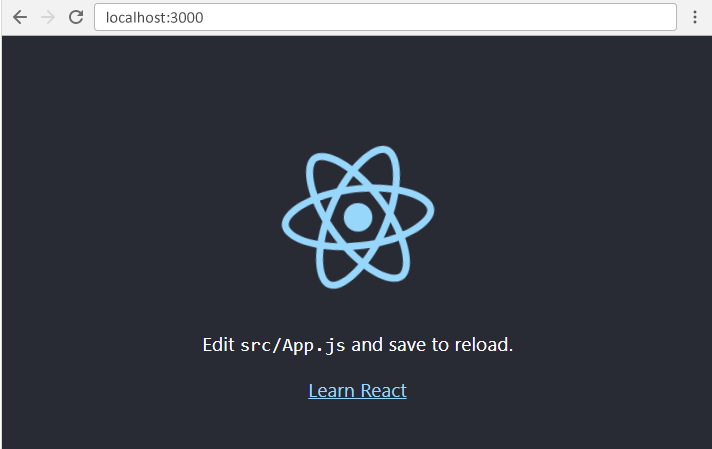

# Créer une application web pour obtenir les dernières nouvelles sur la Covid-19 avec React et une API web


## Introduction

Apprendre une nouvelle technologie a souvent été une expérience assez frustrante. Une des bonnes méthodes pour apprendre serait d'appliquer ses connaissances tout au long de son apprentissage pour pouvoir ainsi garder sa motivation dans l'espoir de réaliser quelque chosee d'utile avec ce qu'on apprend.

Ce tutoriel répond à ce besoin. Nous réaliserons une application web qui nous permettra d'obtenir les dernières nouvelles sur la covid-19. Nous allons pour cela utiliser React et l'API de The New York Times. 

L'idée m'est venue de la situation pandémique actuelle, dans laquelle être informé reste un des moyens les plus éfficaces pour adopter les mésures adéquats contre le virus. Après tout, "un homme informé en vaux deux" non ?

Je ne prétends pas que vous apprendriez ici quelque chose de carrément révolutionnaire, mais à partir des connaissances que vous acquérirez vous pourriez par la suite réaliser un plus grand projet.

Voici le lien vers l'application finale https://nmjd.github.io/CovidNewsApp/

Vous trouverez les codes sources ici https://github.com/NMJD/CovidNewsApp sur la branche master.

### Alors qu'est-ce que c'est React ?

React est une bibliothèque JavaScript développée en 2013 par Facebook. Il sert à créer des apps web monopages et l'un de ses avantages c'est le concept de composants réutilisables.

### A qui ce tutoriel s'adresse-t-il ?

Ce tutoriel est destiné à ceux qui veulent apprendre React et qui ont des bonnes connaissances sur les technologies basiques du web.

Il se déroulera comme suit:

* [Installation de l'environnement de développement local](#1)
* [Creation des composants React](#2)
* [Consommation de l'API avec React](#3)
    * [Envoie des données à l'objet `state` du composant classe News](#4) <br>
    * [Envoie des données aux `props` des composants fonctions](#5)<br>
* [Ce que nous avouns appris](#6)<br>
* [ET APRES ?](#7)<br>
* [Liens utiles](#8)<br>


## Avant de commencer

Vous devez connaitre:

* Javascript (ES6)
* APIs Web
* HTML
* CSS

Si vous vous sentez confus pendant la lecture du tutoriel, ne vous inquiétez pas c'est tout à fait normal. Etant donné que je ne peux pas tout vous apprendre ici, j'ai fourni plusieurs liens le long et à la fin de ce tutoriel pour vous aider à comprendre certains concepts. Vous pouvez vous y rendre de temps en temps.


## <a id="1">Installation de l'environnement de développement local</a> <br>

Pour utiliser React, nous aurons besoin de:

* Nodejs
    * Tapez la commande `$ sudo apt install nodejs` dans le terminale.
    * Entrez ensuite la commande `node -v` pour connaitre la version installée et ainsi s'assurer que tout s'est bien passé.

* NPM (gestionnaire de packages de Node)
    * Tapez la commande `$ sudo apt install npm` dans le terminale.
    * Entrez ensuite la commande `npm -v` pour connaitre la version installée et ainsi s'assurer que tout s'est bien passé.

NB: Pour les utilisateurs des SE autres que les distributions linux, rendez vous sur le site officiel de [nodejs](nodejs.org) pour savoir comment procéder à l'installation.


Grace à npm nous pouvons maintenant installer le package create-react-app qui nous permet de créer des applications react.

Tapez `$ sudo npm install -g create-react-app`

Pour créer une nouvelle application tapez `npx create-react-app monapplireact`

Poursuivez avec les étapes suivantes:

* `$ cd myfirstreact`
* `$ npm start`

Si tout se passe bien la fenetre suivante s'ouvrira dans votre navigateur



Maintenant rendez vous dans le sous-dossier src de votre application, supprimez tout sauf les fichiers index.js et index.html (qui peut se trouver dans le sous-dossier public ). Modifiez ensuite le contenu de chaque fichier :

Fichier index.html


Fichier index.js


## <a id="2">Création des composants React</a><br>

Si vous êtes arrivé ici, c’est que tout se passe bien pour vous. Et je vous en félicite !

Pour créer les composants, react utilise un langage "facilitateur", le JSX (JavaScript XML), qui permet d'écrire du HTML avec JavaScript. Pour en apprendre plus sur le JSX rendez vous sur [ce lien](www.w3schools.com/react/react_jsx.asp)

Il existe deux types de composants : les composants fonctions et  les composants classes.


### Création d'un composant fonction Titre

```JavaScript
const Titre = () => {
    return(
        <h4></h4>
    );
} 
``` 
#### Création d'un composant fonction PLignes

```JavaScript
 const PLignes = () => {
    return(
        <p></p>
    );
} 
```

### Création d'un composant fonction Liens

```JavaScript
const Liens = () => {
    return(
        <p></p>
    );
} 
``` 

### Création d'un composant fonction Source

```JavaScript
const Source = () => {
    return(
        <p></p>
    );
} 
``` 
### Création du composant class News

News est un composant composé qui contient tous les autres composants

```JavaScript
class News extends React.Component {
    constructor(props) {
        super(props);
    }

    render() {
        return(
            <div>
                <Titre />
                <P_Lignes />
                <Liens />
                <Source />
            </div>
        );
    }
}
```
Comme vous l'aurez remarqué, la différence entre ces deux types de composants c'est l'utilisation ou non du concept de classe.

Nous mettons tous ces composants dans un fichier `News.js`, puis nous exportons le composant News avec la commande `export default News`

Ensuite nous créons un fichier `Header.js` qui contiendra le composant Header, puis nous l'exportons avec la commande `export default Header`. Comme ceci:

```JavaScript
import React from 'react';

class Header extends React.Component {
    render() {
        return(
            <div id="header">
            <h2>Covid News APP</h2>
            <h4>By Michel NZIHOU</h4>
            </div>
        );
    }
}

export default Header;
```

Dans le fichier `index.js`, nous allons créer le composant `Tout` qui sera notre composant principal et contiendra les composants Header et News que nous allons importer. Voici le code :

```JavaScript
import React from 'react';
import ReactDOM from 'react-dom';
import styles from './style.scss';
import News from './News';
import Header from './Header';

class Tout extends React.Component {

    render() {

             return (  
           <div>
            <Header />
            {
            <News />
            }
           </div>
        );
    }
}

ReactDOM.render(<Tout />, document.getElementById('root'));
```
Le composant Tout est inséré dans le DOM, précisement dans le div ayant pour id "root" (voir index.html) grâce à la méthode `ReactDOM.render()`.

NB: vous avez certainement constaté l'import du fichier styles.scss. C'est un fichier contenant du CSS compilé pour le design de l'application.

## <a id="3">Consommation de l'API avec React</a><br>

L'API utilisée est celle du New York Times, vous devez créer un compte sur le site https://developer.nytimes.com/ pour obtenir une clé et ainsi utiliser gratuitement l'API à des fins non commerciales.

Les données de l'API seront envoyées au `state` du composant News ensuite vers les `props` des composants fonctions.

### <a id="4">Envoie des données à l'objet `state` du composant classe News</a>

Mais c'est quoi le state me diriez vous?

Eh bien c'est tout simplement un objet incorporé dans les composants React et qui sert à stocker les propriétés d'un composant, ce qu'on appelerait des attributs de classe en POO. Il est initialisé dans le constructeur de la classe.

Créons un objet state pour notre composant News.

```JavaScript

class News extends React.Component {
    constructor(props) {
        super(props);
        this.state = {
            error: null,
            isLoaded: false,
            docs: []};
    }


    componentDidMount() {
        fetch("https://api.nytimes.com/svc/search/v2/articlesearch.json?q=Coronavirus&page=0&api-key=taCléAPI") // taCléAPI est la clé fournie après la création du compte sur https://developer.nytimes.com/
          .then(res => res.json())
          .then(
            (result) => {
              this.setState({
                isLoaded: true,
                docs: result.response.docs
              });
            },
            
            (error) => {
              this.setState({
                isLoaded: true,
                error
              });
            }
          )
      }
```

Si vous avez bien fait vos cours sur l'orienté objet, vous n'aurez aucun mal à comprendre ce code.

Notons tout de même l'utilisation de la méthode componentDidMount(). Celle-ci fait partie du cycle de vie d'un composant React, elle est appelée juste après que le composant ait été rendu, c'est-à-dire qu'une fois inséré dans le DOM.

Pour en savoir plus sur le cycle de vie d'un composant React vous pouvez cliquer [ici](https://www.w3schools.com/react/react_lifecycle.asp).

En gros ce que nous avons fait dans cette méthode c'est faire appel à l'API avec la fonction fetch() (vous pouvez en apprendre plus [ici](https://developers.google.com/web/updates/2015/03/introduction-to-fetch) ), ensuite nous avons enregistré les données qui nous intéressent dans la propriété docs de notre objet state.


### <a id="5">Envoie des données aux `props` des composants fonctions</a>

Il ne reste plus qu'à ajouter des props pour envoyer des données aux autres composants.

Les props (propriétés) sont des arguments que nous passons aux composants, comme nous savons le faire avec les attributs en HTML.

Nous pouvons ensuite les récupérer comme paramètres de nos composants fonctions.

Voici le code au complet :

``` JavaScript
import React from 'react';

const Titre = (props) => {
    return(
        <h4>{props.titre}</h4>
    );
}
Titre.defaultProps = {titre: "Vide"};


const Plignes = (props) => {
    return(
        <p>{props.paragraph}</p>
    );
}
Plignes.defaultProps = {paragraph: "Vide"};


const Liens = (props) => {
    return(
        <a href={props.lien} target="_blank">Lien vers l'article</a>
    );
}
Liens.defaultProps = {lien: "Vide"};


const Source = (props) => {
    return(
        <p>{props.source}</p>
    );
}
Source.defaultProps = {source: "Vide"};


class News extends React.Component {
    constructor(props) {
        super(props);
        this.state = {
            error: null,
            isLoaded: false,
            docs: []};
    }


    componentDidMount() {
        fetch("https://api.nytimes.com/svc/search/v2/articlesearch.json?q=Coronavirus&page=0&api-key=taCléAPI") //N'oubliez pas de remplacer taCléAPI par votre propre clé
          .then(res => res.json())
          .then(
            (result) => {
              this.setState({
                isLoaded: true,
                docs: result.response.docs
              });
            },
            
            (error) => {
              this.setState({
                isLoaded: true,
                error
              });
            }
          )
      }

    render() {

        const { error, isLoaded, docs } = this.state;
        if (error) {
          return <div>Erreur : {error.message}</div>;
        } else if (!isLoaded) {
          return <div>Chargement des News…</div>;
        } else {


        return(
            <div>
            {docs.map(item => 
                <div id="elements">
                <Titre titre={item.snippet}/>
                <Plignes paragraph={item.lead_paragraph}/>
                <Liens lien={item.web_url}/>
                <Source source={item.source}/>
                </div>
            )
            }
            </div>
        );
        }
        
    }
}


export default News;
```

`Titre.defaultPros` permet de definir une propriété par défaut au cas où aucune propriété ne serait passé comme attribut à l'élément Titre. Il en est de même pour les autres composants.

## <a id="6">Ce que nous avons appris</a>

* Comment créer des composants
* Comment utiliser l'objet state d'un composant classe pour enregistrer les données de l'API
* Comment utiliser les propriétés d'un composant fonction pour afficher les données provenant de l'API.

## <a id="7">ET APRES ?</a>
Pour déployer votre application veuillez suivre les étapes sur ce [lien](https://github.com/gitname/react-gh-pages)

Cette application peut être améliorée:
* En ajoutant un bouton pour le chargement des données
* En ajoutant un bouton pour afficher plus d'articles...

Bref! Je laisse place à votre imagination fertile.

Si vous voulez contribuer à ce projet ou poser des questions ou encore faire des remarques n'hésitez pas à m'écrire à l'adresse mail spectrermn@gmail.com

Merci d'avoir lu ce tutoriel, à très bientôt j'espère. <br>


## <a id="8">Liens utiles</a>

* [Intro à React](https://fr.reactjs.org/tutorial/tutorial.html)<br>

* [React Tutorial](https://www.w3schools.com/react/)<br>

* [Introduction aux API du Web](https://developer.mozilla.org/fr/docs/Apprendre/JavaScript/Client-side_web_APIs/Introduction) <br>
